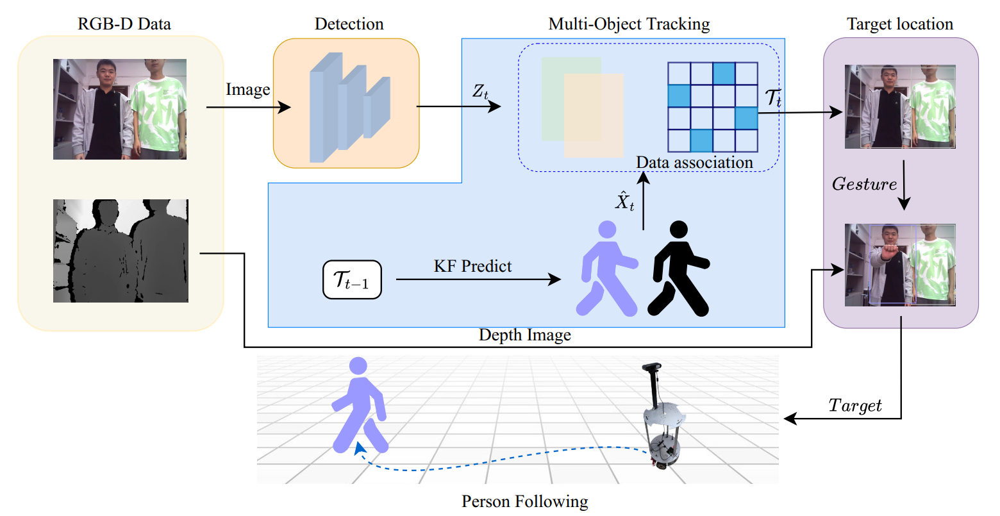
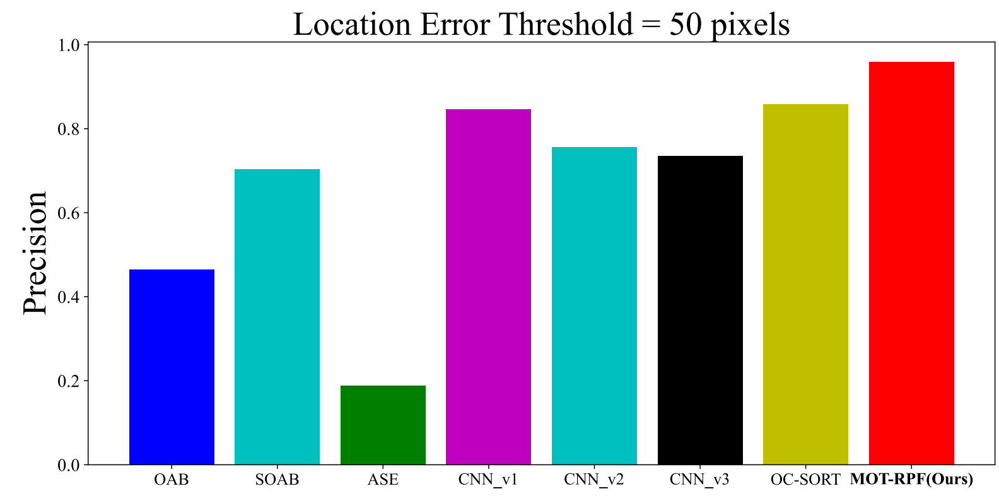
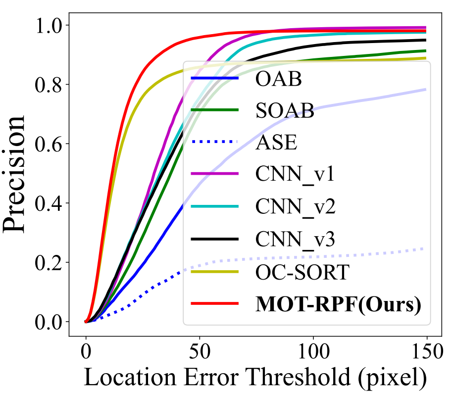
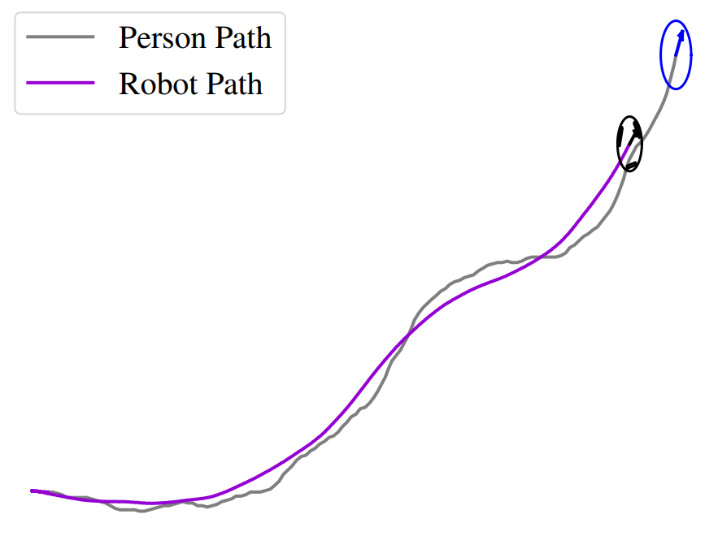
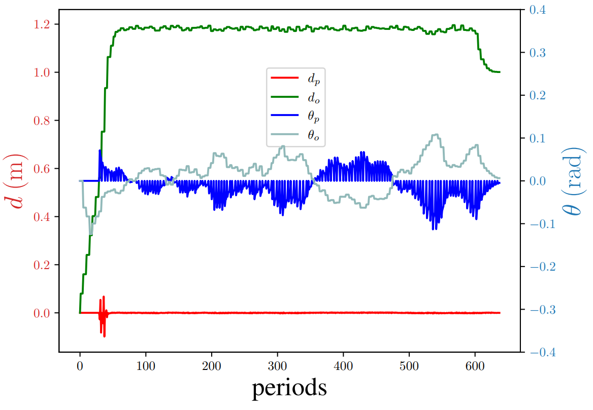

# MOT-RPF
## Abstract
Existing Robot Person Following usually assumes that the object is selected in the initial frame, which renders it incapable of switching the tracking object in subsequent frames. In this context, traditional methods such as object selection, person re-identification, or pose tracking that rely solely on the initial frame fall short of meeting the requirements of complex human-computer interaction applications. To address these limitations, this paper proposes a comprehensive framework for mobile robot person following based on multi-object tracking. Firstly, the framework integrates the improved OCSORT tracking algorithm with gesture detection technology, enabling dynamic selection and precise identification and location estimation of multiple objects. Secondly, by planning the Dubins path and proposing a Lateral and Longitudinal Control Model based on the omnidirectional wheel robot, precise path tracking on the omnidirectional wheel mobile robot can be achieved. The proposed improved OC-SORT tracking algorithm was evaluated on public datasets such as DanceTrack and Person Tracking, demonstrating tracking and location accuracies of 60.5HOTA and 98.1% respectively, surpassing existing multi-object tracking OC-SORT and single-object tracking ODFS. The proposed robot person following framework operates on embedded systems equipped with NVIDIA Jetson Xavier NX and has proven effective in performing person following tasks, both on a custom Person Following dataset and in real-world scenarios.



## Install
We tested this package on Xavier NX/Jetpack 5.1.1 (Ubuntu20.04 with CUDA >= 11.4)
```shell
git clone https://github.com/djdodsjsjx/MOT-RPF.git
cd MOT-RPF
pip3 install -r requirements.txt
python3 setup.py develop
```

## Data preparation
### 1. Datasets
For Public datasets, Download [DanceTrack](https://github.com/DanceTrack/DanceTrack), [Person Tracking](http://jtl.lassonde.yorku.ca/2017/05/person-following-cnn/), [Person Following](https://drive.google.com/drive/folders/1K08U6ZURJcOgle5tU2PKHtlk4i2jlbAv?usp=sharing) and put them under <MOT-RPF>/datasets in the following structure:
```shell
datasets
└——————dancetrack        
        └——————train
        └——————val
        └——————test
└——————pt
└——————pf
```
### 2. Pre-trained Weights
1. To facilitate direct evaluation of tracking and localization performance, we employed the YOLOX-X model for preprocessing detection files on the [DanceTrack](https://drive.google.com/drive/folders/1K08U6ZURJcOgle5tU2PKHtlk4i2jlbAv?usp=sharing) and [Person Tracking](https://drive.google.com/drive/folders/1K08U6ZURJcOgle5tU2PKHtlk4i2jlbAv?usp=sharing) datasets, and put them under <MOT-RPF>/exps in the following structure:
    ```
    exps
    |——————dancetrack
    |        └——————yolox_x
    |           └——————val
    |           └——————test
    |——————pt
    |        └——————yolox_x
    |           └——————test
    ```
2. We have implemented the [YOLOX-Nano](https://drive.google.com/drive/folders/1K08U6ZURJcOgle5tU2PKHtlk4i2jlbAv?usp=sharing) pedestrian detection model and the [MobileNet](https://drive.google.com/drive/folders/1K08U6ZURJcOgle5tU2PKHtlk4i2jlbAv?usp=sharing) gesture detection model for real-time tracking on mobile robots, and put them under <MOT-RPF>/exps in the following structure:
    ```
    pretrained
    |——————SSDLiteMobileNetV3Small.pth
    |——————yolox_nano.pth.tar
    ```

## Quick Test
### 1. DanceTrack
Test with DanceTrack dataset(Window with NVIDIA GeForce RTX 3060Ti GPU):
```shell
cd MOT-RPF
python3 tools/run_bamsort_dance.py
```
please submit your output files(under <MOT-PRF>/evaldata/trackers/danceTrack/test/mot-rpf-dancetrack/data) to [the DanceTrack evaluation site](https://competitions.codalab.org/competitions/35786). Following submission, you can expect a HOTA score ranging from 60.0 to 60.5. The following is one of the sequence visualization results：
<div style="display: flex; justify-content: space-between;">
  
</div>

### 2. Person Tracking
Test with Person Tracking dataset(Window with NVIDIA GeForce RTX 3060Ti GPU):
```shell
cd MOT-RPF
python3 tools/run_bamsort_pt.py
```
You can get the following visual results(under <MOT-PRF>/evaldata/trackers/pt/test/mot-rpf-pt/fig):
<div style="display: flex; justify-content: space-between;">
  
  
</div>

The following is one of the sequence visualization results：
<div style="display: flex; justify-content: space-between;">
  
</div>

### 3. Person Following
Test with Person Following dataset(Jetson Xavier NX):
```shell
cd MOT-RPF
sudo -E /usr/bin/python3 motionplanning/motionplanning.py
```
You can get the following visual results(under <MOT-RPF>/evaldata/control):
<div style="display: flex; justify-content: space-between;">
  
  
  
</div>

### 4. World-Real Robot Person Following
Test with Robot person following in real scenarios(Jetson Xavier NX)：
```shell
cd MOT-RPF
sudo -E /usr/bin/python3 tools/track_bamsort.py
```
The following are the results of our testing in outdoor scenes：
<div style="display: flex; justify-content: space-between;">
  
</div>


## Acknowledgement
- [OC-SORT](https://github.com/noahcao/OC_SORT)
- [HaGRID](https://github.com/hukenovs/hagrid)
- [MotionPlanning](https://github.com/zhm-real/MotionPlanning)

